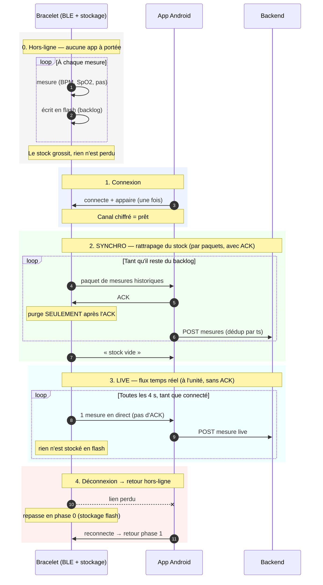

# Firmware

## Fonctionnement général du firmware

Le firmware est charghé sur ESP32-S3. Il mesure le rythme cardiaque, la SpO2
et les pas, et envoie le tout au téléphone en Bluetooth. Rien ne s'affiche sur
le bracelet : toute la visualisation est côté app.

Au démarrage, le firmware initialise dans l'ordre : I2C, les deux capteurs, le
stockage flash, puis le Bluetooth.

Ensuite le firmware tourne dans une boucle qui, à intervalle régulier :

1. lit les capteurs ;
2. en fabrique une mesure compacte (heure, BPM, SpO2, pas) ;
3. l'envoie au téléphone s'il est connecté, sinon l'écrit en flash.

Quand le téléphone revient, il demande l'historique : le bracelet rejoue les
mesures stockées, paquet par paquet, et n'efface un paquet qu'une fois que
l'app a confirmé l'avoir reçu.

A noté que :

- **le bracelet n'a pas d'horloge**. L'horloge est synchornisée par l'app à chaque connexion.
- **un appui long sur le bouton l'endort**. Avant de dormir, il vide ce qui
  reste en RAM vers la flash, sinon ces mesures seraient perdues.

## Vue d'ensemble de la codebase

```
main.cpp            orchestration : setup(), loop()
  ├─ sensors.*      SensorManager  : lit MAX30102 + MPU6050 (I2C)
  ├─ storage.*      Storage        : backlog en flash (LittleFS + NVS)
  ├─ ble_manager.*  BLEManager     : serveur BLE + protocole de synchro
  ├─ power_management.*  PowerManager : deep sleep + réveil bouton
  └─ logic/         code PORTABLE, testé sur PC (structure, arithmérique, horlogie      logicielle)
```

### Captation des données

`src/sensors.cpp` lit les deux capteurs et garde en mémoire trois valeurs :
fréquence cardiaque, SpO2, et cumul de pas.

Le chemin :

```
setup()  bus I2C → oxymètre → accéléromètre
loop()   toutes les 4 s :
           oxymètre       → HR + SpO2 nettoyés
           accéléromètre  → détection de pas → compteur
```

Les deux capteurs partagent le même bus I2C :

| capteur  | modèle   | adresse | mesure      |
|----------|----------|---------|-------------|
| oxymètre | MAX30102 | `0x57`  | BPM + SpO2  |
| IMU      | MPU6050  | `0x68`  | pas         |

- **Un capteur muet ne bloque pas le boot.** Si une init échoue, la LED interne clignote
  le code d'erreur (`ERR_I2C` 0x4, `ERR_MAX30102` 0x5, `ERR_MPU6050` 0x6) et
  cette étape seule est retentée en boucle jusqu'à ce qu'elle passe.
- **Nettoyage à la source.** Une lecture d'oxymètre invalide ou aberrante est
  ramenée à 0 avant tout le reste.
- **Les pas.** TODO dès que PR du nouveau algo !
- **Sans capteur branché**, des valeurs simulées prennent le relais :
  HR = 75, SpO2 = 98, et +10 pas à chaque cycle.

### BLEManager

Toute la communication avec le téléphone passe par le BLEManager.

Le bracelet expose un service GATT et quatre caractéristiques, une par type de
message. L'app écrit dans deux d'entre elles ; le bracelet pousse ses mesures
dans les deux autres par notification, sans attendre d'être interrogé.

| Caractéristique | Qui écrit | Contenu                                          |
|-----------------|-----------|--------------------------------------------------|
| `DATA`          | bracelet  | une mesure en direct                             |
| `HISTORY`       | bracelet  | un paquet de mesures stockées (jusqu'à 20)       |
| `SYNC_CTRL`     | app       | `START`, `ACK` (paquet reçu) ou `STOP`           |
| `TIME`          | app       | l'heure courante (voir « L'heure »)              |

**Le déroulé d'une connexion :**

1. Au boot, le bracelet s'annonce sous le nom `BRASCO-00` — et recommence à
   s'annoncer dès qu'une connexion se termine.
2. Le téléphone se connecte, puis doit s'appairer : un code à 6 chiffres
   s'affiche sur le moniteur série. Tant qu'il n'est pas saisi, l'échange est
   refusé — tout est chiffré, rien ne sort en clair.
3. L'app écrit l'heure, puis `START` pour réclamer l'historique.
4. **Rattrapage.** Le bracelet envoie un paquet et attend l'`ACK` de l'app avant
   d'envoyer le suivant. Sans réponse au bout de 5 s, il renvoie le même paquet.
5. **Direct.** Quand il n'a plus rien en stock, le bracelet le signale et bascule
   en direct : les mesures partent une par une, sans confirmation.

Une déconnexion ramène simplement à l'étape 1, sans rien perdre : les mesures non
confirmées sont toujours en flash (voir « Persistance des données »).

### L'heure (`TimeSource`)

L'horodatage des mesures est tenu par le `TimeSource`.

Le bracelet n'a pas de RTC : au boot il ne sait pas quelle heure il est. Or il
mesure avant même qu'un téléphone se connecte, et ces mesures doivent ressortir
datées. L'app donne donc l'heure sur la caractéristique `TIME` à chaque
connexion ; entre deux connexions le firmware la fait avancer tout seul.

Le champ `ts` d'une mesure porte de ce fait deux choses selon le moment :

- **avant la première synchro** : l'uptime du bracelet, en secondes,
- **après** : un epoch UTC.

Un seuil sépare les deux — un uptime reste petit, un epoch est forcément grand.
L'app Android applique la même règle, elle sait donc toujours ce qu'elle lit.

Quand l'heure arrive, le bracelet peut redater après coup les mesures déjà en
stock : il sait à quel uptime la synchro a eu lieu, il remonte de la différence.
La conversion se fait au moment de l'envoi, le stock reste tel quel.

A noté que :

  - La conversion se fait sur le paquet sortant, pas en flash : réécrire l'anneau
    l'userait pour rien, et un renvoi après timeout refait le même calcul.
  - Une mesure d'un boot précédent (reboot avec du backlog en attente) ne peut pas
    être convertie. C'est un cas qui n'est pas encore gérer dans la version actuelle du firmware.

### Persistance des données

Lorsque le bracelet n'est pas connecté à l'app, il stock les mesures sur sa mémoire. Dès qu'il est connecté, il exportes les données stoquée vers l'app. Une fois toute les données transmise, il se met en mode "live".

Une seule règle rend tout le protocole robuste aux déconnexions : **Le bracelet ne purge son stock qu'après l'ACK**

Toute coupure — perte de portée, erreur BLE, veille du téléphone — produit le même
comportement : les mesures non acquittées restent en flash et repartent à la prochaine
connexion. Une mesure live ratée n'est jamais perdue : elle devient du backlog et sera
rattrapée par la synchro fiable.

- le **backlog** en flash (`Storage` + `RingIndex`, voir §6),
- le **protocole de rattrapage** en BLE (`HISTORY` + `SYNC_CTRL`, START / ACK /
  STOP, voir §7),
- les index sauvés en NVS pour survivre au reboot et au deep sleep de la
  couche 3.

C'est ici qu'apparaît l'invariante centrale : **rien n'est purgé avant l'ACK de
l'app**. Toute la complexité du firmware (états de synchro, timeout, renvoi de
paquet) sert uniquement à tenir cette promesse.

#### Diagramme de séquence




- **IDLE** : pas d'app appairée, ou elle n'a pas dit START.
- **WAIT_ACK** : un paquet est parti, on attend l'ACK. Rien n'est purgé tant
  qu'il n'arrive pas. Pas d'ACK après `SYNC_ACK_TIMEOUT` (5 s) → on renvoie le
  même paquet (sans risque : rien n'a été purgé, l'app déduplique par `ts`).
- **LIVE** : stock vide, les mesures partent au fil de l'eau sans ACK.

Un paquet d'historique = `[type][count]` + les mesures. `type` vaut `0x01`
(il reste des données) ou `0xFF` (stock vide → l'app peut passer en live).
Taille adaptée au **MTU négocié** par le téléphone : s'il est resté à 23
octets, un paquet plein serait tronqué en silence, donc on réduit `count`.

### Le stockage (`Storage`)

Deux étages, pour ne pas user la flash :

1. **Tampon RAM** de `RAM_BATCH` (32) mesures. On n'écrit pas en flash pour
   une mesure toutes les 4 s.
2. **Fichier de taille fixe** en LittleFS (`/data.bin`), utilisé comme
   **tampon circulaire** : `RING_CAPACITY` = 25000 slots × 8 o = 200 Ko,
   ≈ 27 h de mesures. On `seek()` au bon slot et on écrit 8 octets — jamais de
   réécriture du fichier entier.

`RingIndex` fait l'arithmétique (quel slot écrire, quel slot lire) et **ne
touche pas la flash** : c'est ce qui la rend testable sur PC. Elle garde
`head_` (le plus ancien non acquitté) et `count_` ; le tail est déduit.
Ring plein → on écrase le plus ancien et on incrémente `dropped_`.

`head` et `count` sont sauvés en **NVS** (`Preferences`) : sans ça, un reboot
ou un deep sleep perdrait tout le backlog.

Point clé : `readBatch()` lit **sans supprimer**. La purge se fait uniquement
dans `confirm()`, appelé après l'ACK de l'app.

### Format de la donnée `Measurement`

Formaté en 8 octets, little-endian, 

| octets | champ   | sens                                        |
|--------|---------|---------------------------------------------|
| 0–3    | `ts`    | epoch UTC (s). 0 = l'app n'a pas donné l'heure |
| 4      | `hr`    | BPM. 0 = pas de lecture                     |
| 5      | `spo2`  | %. 0 = pas de lecture                       |
| 6–7    | `steps` | cumul de pas, plafonné à 65535              |


Convention : **0 = pas de lecture**. Le driver du MAX30102 renvoie `-1` quand
il n'a rien de valable ; `sanitizeReading()` ramène ça à 0 (sinon `-1` dans un
`uint8_t` devient 255, valeur que le backend refuse). (TODO : idée d'ammélioration, est-ce qu'on pourrait changer le 0 pour différencier une "erreur" et une "personne morte"?)

### Bouton, LED, veille

- **Bouton** (D9 / GPIO8, actif bas, `INPUT_PULLUP`) : appui long de 3 s →
  `storage.flush()`, puis `sensorManager.prepareSleep()`, puis deep sleep.
  Anti-rebond de 30 ms — un contact mécanique rebondit et comptait plusieurs
  appuis.
- **LED d'état** (D10) : clignote toutes les 500 ms en fonctionnement normal
  (« signe de vie » — LED figée = carte coincée), 4 clignotements au passage
  en veille.
- **Réveil** : `ext0` sur GPIO8. `PowerManager` attend le relâchement du bouton
  avant de dormir (sinon réveil immédiat) et ré-arme le pull-up **du domaine
  RTC**, car les pull-ups normaux sont coupés en deep sleep.

Au boot, `setup()` initialise dans l'ordre : I2C → MAX30102 → MPU6050 →
Storage → BLE → advertising. Si une étape échoue, `loop()` entre dans une
boucle de récupération : la LED de la carte clignote `error_code` fois
(`ERR_I2C` = 4, `ERR_MAX30102` = 5, … voir `config.h`) puis on retente
l'initialisation qui a échoué toutes les 3 s. Le bouton reste actif même en
erreur.


## Environnement de développement et commandes du terminal

### Installation

- Installer l'extension PlatformIO sur vscode :  [PlatformIO](https://marketplace.visualstudio.com/items?itemName=platformio.platformio-ide)
- ou chercher "PlatformIO IDE" dans les extensions

### Commande dans le terminal

```bash
pio test -e native        # pour les tests logique (fonctions, ...), se fait en local
pio run -e esp32-s3       # build le firmware (en local)
pio run -e esp32-s3 -t upload             # build et flash la carte
pio run -e esp32-s3 -t upload -t monitor  # flash + serial 115200
pio run -e esp32-s3 -t size               # taille flash/RAM
pio run -e esp32-s3-ci                    # build "sans capteurs"
pio device monitor --baud 115200          # voir les logs
pio check -e esp32-s3 --skip-packages     # cppcheck
pio run -t clean                          # vide .pio/build
pio device list
```

### Adaptation des capteurs
Il y a des environnement dans le fichier platformio.ini
- `esp32-s3` environnement de dev pour les capteurs, il faut les activer !
- `esp32-s3-ci` n'active presque rien -> il permet de tester le bluetouth quand même !
- `native` ne compile aucun code matériel

Pour prendre en compte un capteur, il faut faire #ifdef
```CPP
#ifdef HAS_IMU
  #include "imu.h"
  IMU imu;
#endif

void setup() {
#ifdef HAS_BLUETOOTH
    bluetooth_init();
#endif
#ifdef HAS_IMU
    imu.begin();
#endif
}

void loop() {
#ifdef HAS_IMU
    float accel = imu.readAccel();
#endif
}
```

### Ajouter une librairie

Exemple concret : ajouter l'oxymètre SEN0344 (lib `DFRobot_BloodOxygen_S`).

**1. Déclarer la lib — dans le bon env**

Dans `platformio.ini`, sous `[env:esp32-s3]`

```ini
[env:esp32-s3]
board = seeed_xiao_esp32s3
lib_deps =
    dfrobot/DFRobot_BloodOxygen_S
build_flags =
    -D ARDUINO_USB_CDC_ON_BOOT=1
    -D HAS_BLUETOOTH
    -D HAS_IMU
    -D HAS_OXYGEN      ; <- ton nouveau flag
```

Pourquoi pas sous `[env]` : `[env]` s'applique aussi à `native`, qui compile sur
PC.

**2. Protéger le code par un flag**

Tout ce qui touche le capteur va derrière `#ifdef` — sinon la CI (`esp32-s3-ci`,
sans capteurs) et le esp32 qui n'a pas le module ne compilent plus :

```cpp
#ifdef HAS_OXYGEN
  #include "sensors/oximeter.h"
  Oximeter oxy;
#endif

void setup() {
#ifdef HAS_OXYGEN
    oxy.begin();
#endif
}
```

**3. Vérifier avant de push — les 3 envs**

```bash
pio test -e native        # le code portable compile toujours
pio run -e esp32-s3-ci    # le build "sans capteurs" compile toujours
pio run -e esp32-s3       # ton build avec le capteur compile
```

Si un des trois casse, c'est que la lib ou le `#include` a fuité hors du `#ifdef`.

**Cas particulier : lib de logique pure (pas de matériel)**

Si le code n'utilise pas Arduino, ajoute aussi le fichier au filtre natif pour
qu'il soit testé par la CI :

```ini
[env:native]
build_src_filter = +<message.cpp> +<logic/mon_fichier.cpp>
```

### Secrets
Les logins sont dans le fichier `include/secrets.h`. Ne pas le commiter !

### workflow pour un push

```bash
pio test -e native      # 1. les tests logiques passent
pio run -e esp32-s3     # 2. le firmware compile bien
pio run -e esp32-s3-ci  # 3.le build "sans capteurs" compile toujours
<TEST MANUEL>           # 4. test sur carte de bout-en-bout
git push                # 5. la CI prend le relais (build + test sur carte)
```

### Environnement de dev sans capteurs

Utilise l'env esp32-s3-ci qui ne prends pas en compte les capteurs.

```
pio test -e native      # pour les tests logique (fonctions, ...), se fait en local
pio run -e esp32-s3-ci  # build le firmware (en local)
pio run -e esp32-s3-ci -t upload  # build et flash la carte
pio device monitor --baud 115200  # voir les logs
```
