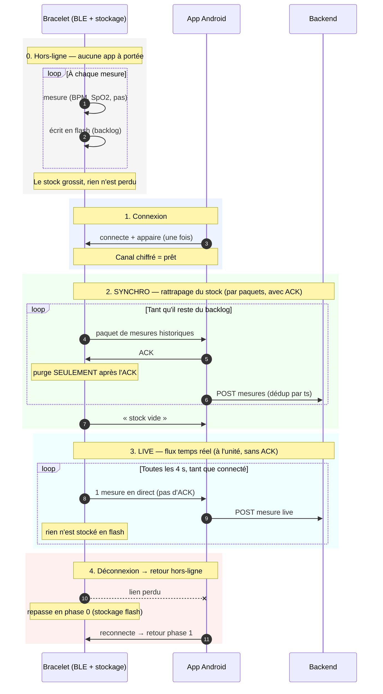

# Firmware

## Fonctionnement général du bracelet

Bracelet sans écran, sur XIAO ESP32S3. Toutes les 4s il :

1. lit les capteurs (BPM + SpO2 sur le MAX30102 et les pas sur le MPU6050)
2. fabrique une mesure de 8 octets
3. l'envoie en BLE au téléphone ou, si le téléphone n'est pas là, la
   sauvegarde pour l'envoyer à la prochaine connextion avec le téléphone.

## Vue d'ensemble de la codebase

```
main.cpp            orchestration : setup(), loop()
  ├─ sensors.*      SensorManager  : lit MAX30102 + MPU6050 (I2C)
  ├─ storage.*      Storage        : backlog en flash (LittleFS + NVS)
  ├─ ble_manager.*  BLEManager     : serveur BLE + protocole de synchro
  ├─ power_management.*  PowerManager : deep sleep + réveil bouton
  └─ logic/         code PORTABLE, testé sur PC (structure, arithmérique, horlogie      logicielle)
```

### Captation des données

Le fichier : `src/sensors.cpp` (`SensorManager`). Il ne fait que lire le
matériel et exposer trois valeurs — `lastHeartRate`, `lastSpO2`,
`stepCounter`.

Le chemin :

```
setup()   initI2C(SDA=5, SCL=6) → initMAX30102() → initMPU6050()
loop()    à chaque tour        : sampleMotion()  (≈50 Hz, auto-limité)
            └─ MPU6050 : getAcceleration() → StepDetector.update() → stepCounter
          toutes les 4 s        : updateReadings()
            └─ MAX30102 : getHeartbeatSPO2() → sanitizeReading() → hr, spo2
          minuit local (offset donné par l'app) : stepCounter remis à 0
```

- **I2C partagé.** Les deux capteurs sont sur le même bus (SDA D4/GPIO5,
  SCL D5/GPIO6), à des adresses différentes : `0x57` pour le MAX30102,
  `0x68` pour le MPU6050. `Wire.begin()` n'est appelé qu'une fois.
- **Nettoyage à la source.** Le driver du MAX30102 renvoie `-1` quand il n'a
  rien de valable (pas de doigt, signal bruité). Rangé dans un `uint8_t`, ce
  `-1` devient 255 — une valeur que le protocole n'a jamais prévue.
  `sanitizeReading()` (dans `logic/`, donc testé sur PC) ramène tout ce qui est
  ≤ 0 ou aberrant à "0 = pas de lecture".
- **Les pas.** `sampleMotion()` échantillonne l'accéléromètre à ~50 Hz (une
  foulée dure ~0,5 s : à 4 s d'intervalle on ne détectait rien) et passe la
  norme du vecteur à `StepDetector` (`logic/`, testé sur PC) : filtre passe-bas,
  estimation de gravité, machine à états 1-pic avec hystérésis et garde de
  cadence. `stepCounter` est **le total du jour** : `main.cpp` le remet à 0 au
  passage de minuit **local** (l'app envoie l'offset UTC avec l'heure). Rien en
  aval ne recalcule ce total.
- **Le mode simulé.** Sans le flag `HAS_OXYGEN`, `updateReadings()` renvoie
  HR = 75 / SpO2 = 98 ; sans `HAS_IMU`, `SIM_STEPS_PER_READ` pas à chaque tour.

### BLEManager

1. **La carte est visible.** `NimBLEDevice::init()` + `startAdvertising()`
2. **La connexion tient.** On branche `MyServerCallbacks`
4. **L'appairage.** `setSecurityAuth()`
5. **Chiffrement** : Tout est chiffré (`READ_ENC` / `WRITE_ENC`) : sans appairage, l'app ne lit ni
n'écrit rien. Appairage par passkey statique (`BLE_STATIC_PASSKEY`), affiché
sur le moniteur série.
6. **L'écriture dans l'autre sens.** La caractéristique `TIME` : l'app écrit
   l'epoch UTC, le bracelet le reçoit. Premier trajet téléphone → bracelet,
   et première occasion de rencontrer le piège des callbacks (voir §7 et voir chap. time).

Un service, quatre caractéristiques (UUIDs dans `config.h`) :

| Caractéristique | Sens      | Rôle                                        |
|-----------------|-----------|---------------------------------------------|
| `DATA`          | notify    | mesure live (8 octets)                      |
| `HISTORY`       | notify    | paquet de mesures du backlog                |
| `SYNC_CTRL`     | write     | 1 octet : START / ACK / STOP                |
| `TIME`          | write     | epoch UTC uint32 LE (+ offset local int32 LE en option, 8 o), donné par l'app |

### L'heure (`TimeSource`)

Le bracelet n'a pas de RTC : au boot il ne sait pas quelle heure il est. L'app
écrit sur `TIME` à chaque connexion l'epoch UTC courant, suivi (payload 8 octets)
de l'offset UTC local en secondes ; entre deux synchros on extrapole avec
`millis()`. Tant que rien n'est reçu, `now()` renvoie l'uptime (pas 0, sinon
toutes les mesures backlog partagent le même `ts`) et `resolve()` reconvertira
en epoch réel à l'envoi. L'offset ne sert qu'à `localDayNumber()` pour la remise
à 0 des pas à minuit local ; `now()`/`resolve()` restent en UTC.

### Persistance des données

Lorsque le bracelet n'est pas connecté à l'app, il stock les mesures sur sa mémoire. Dès qu'il est connecté, il exportes les données stoquée vers l'app. Une fois toute les données transmise, il se met en mode "live".

Une seule règle rend tout le protocole robuste aux déconnexions : **Le bracelet ne purge son stock qu'après l'ACK**

Toute coupure — perte de portée, erreur BLE, veille du téléphone — produit le même
comportement : les mesures non acquittées restent en flash et repartent à la prochaine
connexion. Une mesure live ratée n'est jamais perdue : elle devient du backlog et sera
rattrapée par la synchro fiable.

- le **backlog** en flash (`Storage` + `RingIndex`, voir §6),
- le **protocole de rattrapage** en BLE (`HISTORY` + `SYNC_CTRL`, START / ACK /
  STOP, voir §7),
- les index sauvés en NVS pour survivre au reboot et au deep sleep de la
  couche 3.

C'est ici qu'apparaît l'invariante centrale : **rien n'est purgé avant l'ACK de
l'app**. Toute la complexité du firmware (états de synchro, timeout, renvoi de
paquet) sert uniquement à tenir cette promesse.

#### Diagramme de séquence




- **IDLE** : pas d'app appairée, ou elle n'a pas dit START.
- **WAIT_ACK** : un paquet est parti, on attend l'ACK. Rien n'est purgé tant
  qu'il n'arrive pas. Pas d'ACK après `SYNC_ACK_TIMEOUT` (5 s) → on renvoie le
  même paquet (sans risque : rien n'a été purgé, l'app déduplique par `ts`).
- **LIVE** : stock vide, les mesures partent au fil de l'eau sans ACK.

Un paquet d'historique = `[type][count]` + les mesures. `type` vaut `0x01`
(il reste des données) ou `0xFF` (stock vide → l'app peut passer en live).
Taille adaptée au **MTU négocié** par le téléphone : s'il est resté à 23
octets, un paquet plein serait tronqué en silence, donc on réduit `count`.

### Le stockage (`Storage`)

Deux étages, pour ne pas user la flash :

1. **Tampon RAM** de `RAM_BATCH` (32) mesures. On n'écrit pas en flash pour
   une mesure toutes les 4 s.
2. **Fichier de taille fixe** en LittleFS (`/data.bin`), utilisé comme
   **tampon circulaire** : `RING_CAPACITY` = 25000 slots × 8 o = 200 Ko,
   ≈ 27 h de mesures. On `seek()` au bon slot et on écrit 8 octets — jamais de
   réécriture du fichier entier.

`RingIndex` fait l'arithmétique (quel slot écrire, quel slot lire) et **ne
touche pas la flash** : c'est ce qui la rend testable sur PC. Elle garde
`head_` (le plus ancien non acquitté) et `count_` ; le tail est déduit.
Ring plein → on écrase le plus ancien et on incrémente `dropped_`.

`head` et `count` sont sauvés en **NVS** (`Preferences`) : sans ça, un reboot
ou un deep sleep perdrait tout le backlog.

Point clé : `readBatch()` lit **sans supprimer**. La purge se fait uniquement
dans `confirm()`, appelé après l'ACK de l'app.

### Format de la donnée `Measurement`

Formaté en 8 octets, little-endian, 

| octets | champ   | sens                                        |
|--------|---------|---------------------------------------------|
| 0–3    | `ts`    | epoch UTC (s). 0 = l'app n'a pas donné l'heure |
| 4      | `hr`    | BPM. 0 = pas de lecture                     |
| 5      | `spo2`  | %. 0 = pas de lecture                       |
| 6–7    | `steps` | pas du jour (remis à 0 à minuit local), plafonné à 65535 |


Convention : **0 = pas de lecture**. Le driver du MAX30102 renvoie `-1` quand
il n'a rien de valable ; `sanitizeReading()` ramène ça à 0 (sinon `-1` dans un
`uint8_t` devient 255, valeur que le backend refuse). (TODO : idée d'ammélioration, est-ce qu'on pourrait changer le 0 pour différencier une "erreur" et une "personne morte"?)

### Bouton, LED, veille

- **Bouton** (D9 / GPIO8, actif bas, `INPUT_PULLUP`) : appui long de 3 s →
  `storage.flush()`, puis `sensorManager.prepareSleep()`, puis deep sleep.
  Anti-rebond de 30 ms — un contact mécanique rebondit et comptait plusieurs
  appuis.
- **LED d'état** (D10) : clignote toutes les 500 ms en fonctionnement normal
  (« signe de vie » — LED figée = carte coincée), 4 clignotements au passage
  en veille.
- **Réveil** : `ext0` sur GPIO8. `PowerManager` attend le relâchement du bouton
  avant de dormir (sinon réveil immédiat) et ré-arme le pull-up **du domaine
  RTC**, car les pull-ups normaux sont coupés en deep sleep.

Au boot, `setup()` initialise dans l'ordre : I2C → MAX30102 → MPU6050 →
Storage → BLE → advertising. Si une étape échoue, `loop()` entre dans une
boucle de récupération : la LED de la carte clignote `error_code` fois
(`ERR_I2C` = 4, `ERR_MAX30102` = 5, … voir `config.h`) puis on retente
l'initialisation qui a échoué toutes les 3 s. Le bouton reste actif même en
erreur.


## Environnement de développement et commandes du terminal

### Installation

- Installer l'extension PlatformIO sur vscode : https://marketplace.visualstudio.com/items?itemName=platformio.platformio-ide
- ou chercher "PlatformIO IDE" dans les extensions

### Commande dans le terminal

```bash
pio test -e native # pour les tests logique (fonctions, ...), se fait en local
pio run -e esp32-s3 # build le firmware (en local)
pio run -e esp32-s3 -t upload # build et flash la carte
pio run -e esp32-s3 -t upload -t monitor # flash + serial 115200
pio run -e esp32-s3 -t size             # taille flash/RAM
pio run -e esp32-s3-ci                  # build "sans capteurs"
pio device monitor --baud 115200 # voir les logs
pio check -e esp32-s3 --skip-packages   # cppcheck
pio run -t clean                        # vide .pio/build
pio device list
```

### Adaptation des capteurs
Il y a des environnement dans le fichier platformio.ini
- `esp32-s3` environnement de dev pour les capteurs, il faut les activer !
- `esp32-s3-ci` n'active presque rien -> il permet de tester le bluetouth quand même !
- `native` ne compile aucun code matériel

Pour prendre en compte un capteur, il faut faire #ifdef
```CPP
#ifdef HAS_IMU
  #include "imu.h"
  IMU imu;
#endif

void setup() {
#ifdef HAS_BLUETOOTH
    bluetooth_init();
#endif
#ifdef HAS_IMU
    imu.begin();
#endif
}

void loop() {
#ifdef HAS_IMU
    float accel = imu.readAccel();
#endif
}
```

### Ajouter une librairie

Exemple concret : ajouter l'oxymètre SEN0344 (lib `DFRobot_BloodOxygen_S`).

**1. Déclarer la lib — dans le bon env**

Dans `platformio.ini`, sous `[env:esp32-s3]`

```ini
[env:esp32-s3]
board = seeed_xiao_esp32s3
lib_deps =
    dfrobot/DFRobot_BloodOxygen_S
build_flags =
    -D ARDUINO_USB_CDC_ON_BOOT=1
    -D HAS_BLUETOOTH
    -D HAS_IMU
    -D HAS_OXYGEN      ; <- ton nouveau flag
```

Pourquoi pas sous `[env]` : `[env]` s'applique aussi à `native`, qui compile sur
PC.

**2. Protéger le code par un flag**

Tout ce qui touche le capteur va derrière `#ifdef` — sinon la CI (`esp32-s3-ci`,
sans capteurs) et le esp32 qui n'a pas le module ne compilent plus :

```cpp
#ifdef HAS_OXYGEN
  #include "sensors/oximeter.h"
  Oximeter oxy;
#endif

void setup() {
#ifdef HAS_OXYGEN
    oxy.begin();
#endif
}
```

**3. Vérifier avant de push — les 3 envs**

```bash
pio test -e native        # le code portable compile toujours
pio run -e esp32-s3-ci    # le build "sans capteurs" compile toujours
pio run -e esp32-s3       # ton build avec le capteur compile
```

Si un des trois casse, c'est que la lib ou le `#include` a fuité hors du `#ifdef`.

**Cas particulier : lib de logique pure (pas de matériel)**

Si le code n'utilise pas Arduino, ajoute aussi le fichier au filtre natif pour
qu'il soit testé par la CI :

```ini
[env:native]
build_src_filter = +<message.cpp> +<logic/mon_fichier.cpp>
```

### Secrets
Les logins sont dans le fichier `include/secrets.h`. Ne pas le commiter !

### workflow pour un push

```bash
pio test -e native      # 1. les tests logiques passent
pio run -e esp32-s3     # 2. le firmware compile bien
pio run -e esp32-s3-ci    # le build "sans capteurs" compile toujours
<TEST MANUEL>           # 3. test sur carte de bout-en-bout
git push                # 4. la CI prend le relais (build + test sur carte)
```

### Pour Ryad et Thomas
Utilise l'env esp32-s3-ci qui ne prends pas en compte les capteurs.

```
pio test -e native # pour les tests logique (fonctions, ...), se fait en local
pio run -e esp32-s3-ci # build le firmware (en local)
pio run -e esp32-s3-ci -t upload # build et flash la carte
pio device monitor --baud 115200 # voir les logs
```
