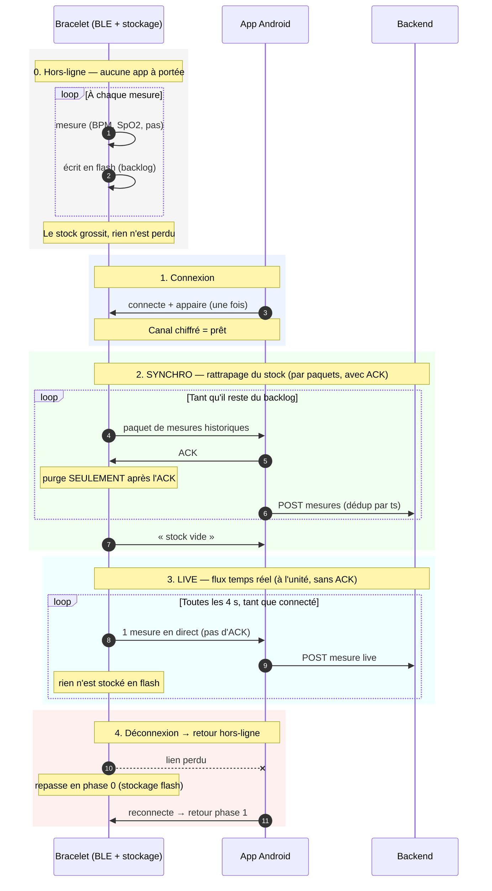
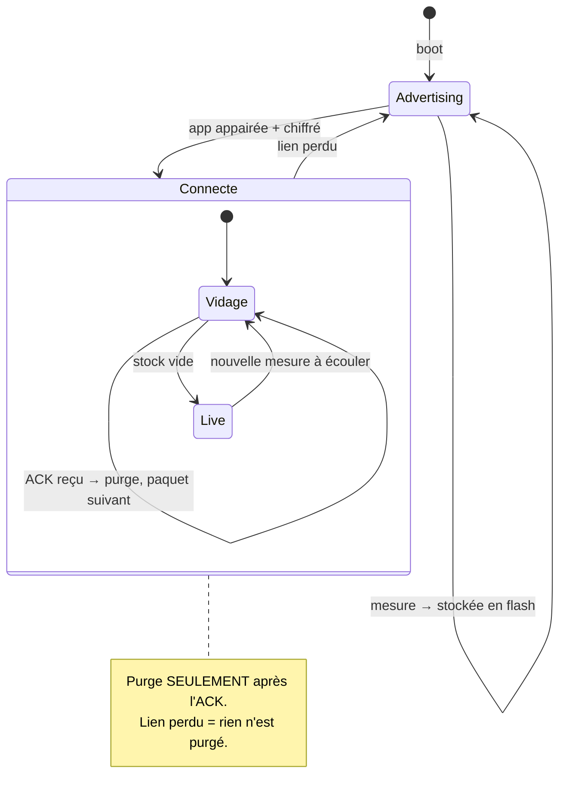
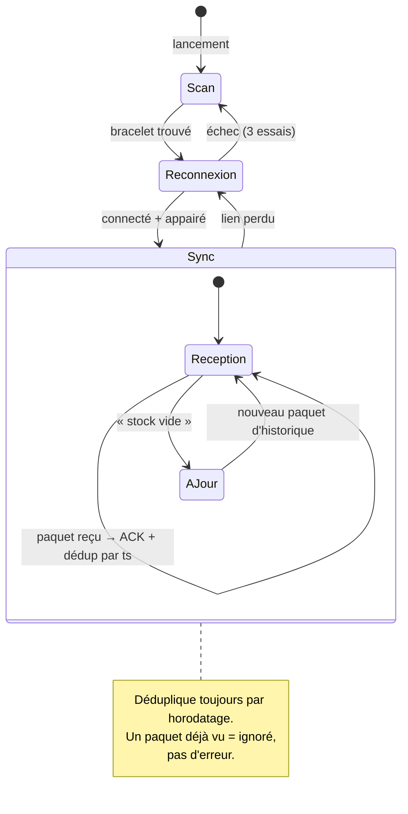

# Firmware

Repo pour le firmware du esp32 et développement

## Installer l'environnement et commandes

- Installer l'extension PlatformIO sur vscode : https://marketplace.visualstudio.com/items?itemName=platformio.platformio-ide
- ou chercher "PlatformIO IDE" dans les extensions

### Commande dans le terminal

```bash
pio test -e native # pour les tests logique (fonctions, ...), se fait en local
pio run -e esp32-s3 # build le firmware (en local)
pio run -e esp32-s3 -t upload # build et flash la carte
pio run -e esp32-s3 -t upload -t monitor # flash + serial 115200
pio run -e esp32-s3 -t size             # taille flash/RAM
pio run -e esp32-s3-ci                  # build "sans capteurs"
pio device monitor --baud 115200 # voir les logs
pio check -e esp32-s3 --skip-packages   # cppcheck
pio run -t clean                        # vide .pio/build
pio device list
```

### Adaptation des capteurs
Il y a des environnement dans le fichier platformio.ini
- `esp32-s3` environnement de dev pour les capteurs, il faut les activer !
- `esp32-s3-ci` n'active presque rien -> il permet de tester le bluetouth quand même !
- `native` ne compile aucun code matériel

Pour prendre en compte un capteur, il faut faire #ifdef
```CPP
#ifdef HAS_IMU
  #include "imu.h"
  IMU imu;
#endif

void setup() {
#ifdef HAS_BLUETOOTH
    bluetooth_init();
#endif
#ifdef HAS_IMU
    imu.begin();
#endif
}

void loop() {
#ifdef HAS_IMU
    float accel = imu.readAccel();
#endif
}
```

### Ajouter une librairie

Exemple concret : ajouter l'oxymètre SEN0344 (lib `DFRobot_BloodOxygen_S`).

**1. Déclarer la lib — dans le bon env**

Dans `platformio.ini`, sous `[env:esp32-s3]`

```ini
[env:esp32-s3]
board = seeed_xiao_esp32s3
lib_deps =
    dfrobot/DFRobot_BloodOxygen_S
build_flags =
    -D ARDUINO_USB_CDC_ON_BOOT=1
    -D HAS_BLUETOOTH
    -D HAS_IMU
    -D HAS_OXYGEN      ; <- ton nouveau flag
```

Pourquoi pas sous `[env]` : `[env]` s'applique aussi à `native`, qui compile sur
PC.

**2. Protéger le code par un flag**

Tout ce qui touche le capteur va derrière `#ifdef` — sinon la CI (`esp32-s3-ci`,
sans capteurs) et le esp32 qui n'a pas le module ne compilent plus :

```cpp
#ifdef HAS_OXYGEN
  #include "sensors/oximeter.h"
  Oximeter oxy;
#endif

void setup() {
#ifdef HAS_OXYGEN
    oxy.begin();
#endif
}
```

**3. Vérifier avant de push — les 3 envs**

```bash
pio test -e native        # le code portable compile toujours
pio run -e esp32-s3-ci    # le build "sans capteurs" compile toujours
pio run -e esp32-s3       # ton build avec le capteur compile
```

Si un des trois casse, c'est que la lib ou le `#include` a fuité hors du `#ifdef`.

**4. Commiter `platformio.ini`**

C'est le seul fichier à commiter — PlatformIO télécharge la lib tout seul chez
les autres au prochain build. Ne jamais commiter `.pio/`.

Prévenir l'équipe : premier build après ton merge = plus lent (téléchargement +
cache CI invalidé). C'est normal.

**Cas particulier : lib de logique pure (pas de matériel)**

Si le code n'utilise pas Arduino, ajoute aussi le fichier au filtre natif pour
qu'il soit testé par la CI :

```ini
[env:native]
build_src_filter = +<message.cpp> +<logic/mon_fichier.cpp>
```

### Secrets
Les logins sont dans le fichier `include/secrets.h`. Ne pas le commiter !

### workflow pour un push

```bash
pio test -e native      # 1. les tests logiques passent
pio run -e esp32-s3     # 2. le firmware compile bien
pio run -e esp32-s3-ci    # le build "sans capteurs" compile toujours
<TEST MANUEL>           # 3. test sur carte de bout-en-bout
git push                # 4. la CI prend le relais (build + test sur carte)
```

### Pour Ryad et Thomas
Utilise l'env esp32-s3-ci qui ne prends pas en compte les capteurs.

```
pio test -e native # pour les tests logique (fonctions, ...), se fait en local
pio run -e esp32-s3-ci # build le firmware (en local)
pio run -e esp32-s3-ci -t upload # build et flash la carte
pio device monitor --baud 115200 # voir les logs
```

## Protocole BLE — bracelet connecté

### Invariante centrale

Une seule règle rend tout le protocole robuste aux déconnexions :

> **Le bracelet ne purge son stock qu'après l'ACK, et l'app déduplique par horodatage (`ts`).**

Toute coupure — perte de portée, erreur BLE, veille du téléphone — produit le même
comportement : les mesures non acquittées restent en flash et repartent à la prochaine
connexion. Une mesure live ratée n'est jamais perdue : elle devient du backlog et sera
rattrapée par la synchro fiable.

---

### Diagramme de séquence



### Synchro vs Live

| | Synchro (phase 2) | Live (phase 3) |
|---|---|---|
| **Source des données** | flash (mesures hors-ligne) | capteur, en direct |
| **Granularité** | paquets (jusqu'à 20 mesures) | 1 mesure à la fois |
| **Fiabilité** | ACK + purge après confirmation | pas d'ACK (perte tolérée) |
| **En cas de coupure** | le paquet non acquitté repart | la mesure part en flash → deviendra du backlog |

---

### État du bracelet (ESP32)



Le bracelet stocke en flash **dans les deux grands états** : en `Advertising` (pas d'app)
et en `Live` dès qu'une mesure ne peut pas partir. Le stockage n'est jamais suspendu.

---

### État de l'app (Android)



La boucle `Reconnexion` absorbe toutes les coupures — perte de portée, erreur BLE,
veille du téléphone — sans traitement spécial par cause.

---

### Correspondance des états

| Bracelet | App | Déclencheur commun |
|---|---|---|
| `Advertising` | `Scan` / `Reconnexion` | pas de lien |
| `Vidage` | `Reception` | paquet ↔ ACK |
| `Live` | `AJour` | « stock vide » |
| retour à `Advertising` | retour à `Reconnexion` | lien perdu |

---

### Contrat technique

Un service, quatre caractéristiques. Tout est chiffré (`_ENC`) : sans appairage,
l'app ne voit rien.

| UUID | Nom | Propriétés | Charge utile |
|---|---|---|---|
| `146ef449-…` | service | — | — |
| `146ef450-…` | `LIVE` | notify | 1 mesure (8 o) |
| `146ef451-…` | `HISTORY` | notify | `[type:1][count:1][mesure × count]` |
| `146ef452-…` | `SYNC_CTRL` | write | 1 octet : `0x01` START, `0x02` ACK, `0x03` STOP |
| `146ef453-…` | `TIME` | write | epoch UTC `uint32` little-endian |

**La mesure — 8 octets, little-endian**, identique en live et en historique :

```
offset 0..3 : uint32 ts     epoch UTC en secondes ; 0 = le bracelet n'avait pas l'heure
offset 4    : uint8  hr     0 = pas de lecture (doigt absent), pas un vrai 0
offset 5    : uint8  spo2   idem
offset 6..7 : uint16 steps  cumul de pas, tronqué à 65535
```

Types de paquet `HISTORY` : `0x01` données, `0xFF` « stock vide ».
`HISTORY_BATCH = 20` mesures par paquet → 20×8+2 = 162 o, ce qui tient dans le
MTU de 185.

Le bracelet renvoie le même paquet s'il n'a pas d'ACK au bout de 5 s. C'est sans
risque : rien n'a été purgé, et l'app déduplique par `(deviceUid, ts)`.

Une mesure arrivée avant que l'app n'ait écrit `TIME` porte `ts = 0` ; c'est
l'app qui lui donne son heure de réception, sinon toutes ces mesures auraient le
même horodatage et la déduplication n'en garderait qu'une.

**Où c'est implémenté**

| Côté | Fichier |
|---|---|
| encodage/décodage, testable sur PC | `src/logic/measurement.{h,cpp}` |
| tampon circulaire (index purs) | `src/logic/ring_index.{h,cpp}` |
| heure sans RTC | `src/logic/time_source.h` |
| flash LittleFS + index NVS | `src/storage.cpp`, `include/storage.h` |
| machine d'état du protocole | `src/ble_manager.cpp` (`tick()`) |
| app : protocole | `domain/BraceletProtocol.kt` |
| app : lien et reconnexion | `domain/BraceletBleClient.kt` |
| app : base locale et dédup | `data/local/` |

### Lire les logs

Les deux côtés gardent la convention `[TAG] message` déjà en place dans le repo,
avec les mêmes tags de part et d'autre (`[SYNC]`, `[STATE]`) : on peut mettre les
deux traces côte à côte et suivre la même séquence.

```
firmware  [SYNC] Paquet #3 envoyé (20 mesures, 162 octets) -> attente ACK
app       [SYNC] Paquet #3 reçu (20 mesures) -> inséré 18 / ignoré 2 (déjà vus) -> ACK
firmware  [Storage] Purge de 20 mesures apres ACK -> flash=1167
```

Côté firmware : `pio device monitor --baud 115200`.
Côté app : `adb logcat -s BRASCO`, ou le bouton **Copier** du journal à l'écran
(200 dernières lignes) quand on n'a pas de câble.

La ligne `STATE` est émise à chaque transition **et** toutes les 5 s. C'est elle
qu'il faut coller dans un ticket :

```
[STATE] conn=1 sync=WAIT_ACK batch=3 attente=20 ram=12 flash=1187 pend=1199 drop=0 ts=1755950400 (heartbeat)
```

- `conn` lien monté et authentifié
- `sync` `IDLE` (attend START) / `WAIT_ACK` (paquet envoyé, attend l'app) / `LIVE`
- `attente` mesures envoyées mais pas encore acquittées — elles ne sont **pas** purgées
- `ram` / `flash` / `pend` mesures en tampon RAM, en flash, total en attente
- `drop` mesures perdues par écrasement du ring (flash pleine, ≈ 27 h sans app)
- `ts` heure vue par le bracelet ; `0` = l'app ne lui a pas encore donné l'heure
