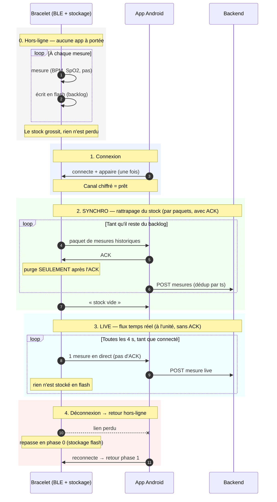

# Documentation technique du firmware

Cette page décrit le fonctionnement interne du firmware : comment il est structuré, comment les données circulent des capteurs jusqu'à l'app, et les choix de conception derrière chaque brique (stockage, protocole BLE, gestion de l'heure, veille).
 
Elle s'adresse à quiconque veut comprendre ou modifier le code. Pour installer l'environnement de dev et les commandes du terminal, voir [CONTRIBUTING.md](./CONTRIBUTING.md).
 
## Table des matières

- [Fonctionnement général du firmware](#fonctionnement-général-du-firmware)
- [Vue d'ensemble de la codebase](#vue-densemble-de-la-codebase)
  - [Captation des données](#captation-des-données)
  - [BLEManager](#blemanager)
  - [L'heure](#lheure-timesource)
  - [Persistance des données](#persistance-des-données)
  - [Le stockage](#le-stockage-storage)
  - [Format de la donnée](#format-de-la-donnée-measurement)
  - [Bouton, LED, veille](#bouton-led-veille)

## Fonctionnement général du firmware

Le firmware est chargé sur ESP32-S3. Il mesure le rythme cardiaque, la SpO2
et les pas, et envoie le tout au téléphone en Bluetooth. Rien ne s'affiche sur
le bracelet : toute la visualisation est côté app.

Au démarrage, le firmware initialise dans l'ordre : I2C, les deux capteurs, le
stockage flash, puis le Bluetooth.

Ensuite le firmware tourne dans une boucle qui, à intervalle régulier :

1. lit les capteurs ;
2. en fabrique une mesure compacte (heure, BPM, SpO2, pas) ;
3. l'envoie au téléphone s'il est connecté, sinon l'écrit en flash.

Quand le téléphone se reconnecte après une coupure, il demande l'historique et le bracelet lui retransmet automatiquement toutes les mesures accumulées pendant la déconnexion.

## Vue d'ensemble de la codebase

```
main.cpp            orchestration : setup(), loop()
  ├─ sensors.*      SensorManager  : lit MAX30102 + MPU6050 (I2C)
  ├─ storage.*      Storage        : backlog en flash (LittleFS + NVS)
  ├─ ble_manager.*  BLEManager     : serveur BLE + protocole de synchro
  ├─ power_management.*  PowerManager : deep sleep + réveil bouton
  └─ logic/         code PORTABLE, testé sur PC (structure, arithmétique, horlogerie logicielle)
```

### Captation des données

`src/sensors.cpp` lit les deux capteurs (oxymètre et accéléromètre)  et garde en mémoire trois valeurs :
fréquence cardiaque, SpO2, et cumul de pas.

Les deux capteurs partagent le même bus I2C :

| capteur  | modèle   | adresse | mesure      |
|----------|----------|---------|-------------|
| oxymètre | MAX30102 | `0x57`  | BPM + SpO2  |
| IMU      | MPU6050  | `0x68`  | pas         |

- **Un capteur muet ne bloque pas le boot.** Si une init échoue, l'erreur est indiquée depuis la LED de l'ESP32 et cette étape seule est retentée en boucle jusqu'à ce qu'elle passe.
- **Les pas.** L'accéléromètre est lu régulièrement (~50 Hz) et un pas est compté quand un pic d'accélération correspond à un mouvement plausible
  (amplitude, durée, écart avec le pas précédent), ce qui évite de confondre un pas avec un simple mouvement de bras.
- **Sans capteur branché**, des valeurs simulées prennent le relais :
  HR = 75, SpO2 = 98, et +10 pas à chaque cycle.

### BLEManager

Toute la communication avec le téléphone passe par le BLEManager.

Le bracelet expose un service GATT et quatre caractéristiques, une par type de
message. L'app écrit dans deux d'entre elles ; le bracelet pousse ses mesures
dans les deux autres par notification, sans attendre d'être interrogé.

| Caractéristique | Qui écrit | Contenu                                          |
|-----------------|-----------|--------------------------------------------------|
| `DATA`          | bracelet  | une mesure en direct                             |
| `HISTORY`       | bracelet  | un paquet de mesures stockées (jusqu'à 20)       |
| `SYNC_CTRL`     | app       | `START`, `ACK` (paquet reçu) ou `STOP`           |
| `TIME`          | app       | l'heure courante (voir « L'heure »)              |

**Le déroulé d'une connexion :**

1. Au boot, le bracelet s'annonce sous le nom `BRASCO-00` — et recommence à
   s'annoncer dès qu'une connexion se termine.
2. Le téléphone se connecte, puis doit s'appairer : un code à 6 chiffres
   s'affiche sur le moniteur série. Tant qu'il n'est pas saisi, l'échange est
   refusé — tout est chiffré, rien ne sort en clair.
3. L'app écrit l'heure, puis `START` pour réclamer l'historique.
4. **Rattrapage.** Le bracelet envoie un paquet et attend l'`ACK` de l'app avant
   d'envoyer le suivant. Sans réponse au bout de 5 s, il renvoie le même paquet.
5. **Direct.** Quand il n'a plus rien en stock, le bracelet le signale et bascule
   en direct : les mesures partent une par une, sans confirmation.

Une déconnexion ramène simplement à l'étape 1, sans rien perdre : les mesures non
confirmées sont toujours en flash (voir « Persistance des données »).

### L'heure (`TimeSource`)

L'horodatage des mesures est tenu par le `TimeSource`.

Le bracelet n'a pas de RTC : au boot il ne sait pas quelle heure il est. Or il
mesure avant même qu'un téléphone se connecte, et ces mesures doivent ressortir
datées. L'app donne donc l'heure sur la caractéristique `TIME` à chaque
connexion ; entre deux connexions le firmware la fait avancer tout seul.

Le champ `ts` d'une mesure porte de ce fait deux choses selon le moment :

- **avant la première synchro** : l'uptime du bracelet, en secondes,
- **après** : un epoch UTC.

Un seuil sépare les deux — un uptime reste petit, un epoch est forcément grand.
L'app Android applique la même règle, elle sait donc toujours ce qu'elle lit.

Quand l'heure arrive, le bracelet peut redater après coup les mesures déjà en
stock : il sait à quel uptime la synchro a eu lieu, il remonte de la différence.
La conversion se fait au moment de l'envoi, le stock reste tel quel.

A noté que :

  - La conversion se fait sur le paquet sortant, pas en flash : réécrire l'anneau
    l'userait pour rien, et un renvoi après timeout refait le même calcul.
  - Une mesure d'un boot précédent (reboot avec du backlog en attente) ne peut pas
    être convertie. C'est un cas qui n'est pas encore gérer dans la version actuelle du firmware.

### Persistance des données

Lorsque le bracelet n'est pas connecté à l'app, il stocke les mesures dans sa
mémoire flash. Dès qu'une app se connecte, il lui envoie ce stock, puis il passe
en mode « live ».

Ce mécanisme existe parce que le bracelet mesure en permanence, y compris quand
aucun téléphone n'est à portée. À la reconnexion il a donc un retard à rattraper,
et rien ne garantit que la liaison tiendra le temps de l'écouler. Le protocole est robuste aux coupures car le firmware ne purge son stock
qu'après l'ACK de l'app.

Deux régimes en découlent :

- **rattrapage** : le stock part par paquets, chacun acquitté par l'app avant
  d'être purgé de la flash ;
- **direct** : stock vide, chaque mesure part seule, sans ACK.

Trois pièces les soutiennent :

- le **backlog** en flash (`Storage` + `RingIndex`, voir « Le stockage
  (`Storage`) »),
- le **protocole de rattrapage** en BLE, sur les caractéristiques `HISTORY` et
  `SYNC_CTRL` (START / ACK / STOP, voir « BLEManager »),
- les index du backlog sauvés en NVS, pour survivre au reboot et au deep sleep
  (voir « Bouton, LED, veille »).

Toute coupure — perte de portée, erreur BLE, veille du téléphone — produit le
même comportement : les mesures non acquittées restent en flash et repartent à la
prochaine connexion. Une mesure live ratée n'est pas perdue non plus : elle
retourne dans le backlog et sera reprise par le rattrapage.

#### Diagramme de séquence


La synchro tient dans trois états. La colonne de droite dit ce qui fait sortir
de l'état ; tout le reste du temps, on y reste.

| État | Ce qui s'y passe | On en sort quand |
|------|------------------|------------------|
| `IDLE` | Aucune app appairée, ou elle n'a pas encore envoyé `START`. Les mesures s'empilent en flash. | L'app envoie `START`. |
| `WAIT_ACK` | Un paquet d'historique est parti, on attend son ACK. Sans ACK au bout de 5 s, on renvoie le même paquet — sans risque, puisque rien n'a été purgé et que l'app déduplique par `ts`. | L'ACK arrive (purge du paquet, envoi du suivant), l'app envoie `STOP`, ou le lien tombe. |
| `LIVE` | Stock vide, les mesures partent au fil de l'eau, sans ACK. | Du backlog réapparaît (une notification ratée, par exemple) : on repasse en rattrapage. |

Un paquet d'historique commence par un en-tête de 4 octets
`[type][count][seqLo][seqHi]`, suivi de `count` mesures (leur format est décrit
dans « Format de la donnée `Measurement` »). `type` vaut `0x11` s'il reste des
données, ou `0xFF` quand le stock est vide, ce qui autorise l'app à passer en
live.

`seq` est le numéro du paquet : l'app le renvoie tel quel dans son ACK, et un ACK
portant un autre numéro est ignoré. Sans ce contrôle, l'ACK tardif d'un paquet
déjà renvoyé passerait pour celui du paquet courant et purgerait des mesures que
l'app n'a jamais reçues.

La taille du paquet s'adapte au **MTU négocié** par le téléphone : s'il est resté
aux 23 octets minimum du BLE, un paquet plein serait tronqué en silence, donc on
réduit `count`.

### Le stockage (`Storage`)

`Storage` garde en flash les mesures que l'app n'a pas encore acquittées auprès de l'application

Nous avons deux contraintes matérielles la flash s'use à chaque
écriture et un reboot et un deep sleep efface la RAM.

Chaque étage répond à une de ces contraintes :

| Contrainte | Choix | Effet |
|------------|-------|-------|
| une écriture flash toutes les 4 s userait la puce | tampon RAM  | une écriture toutes les 2 min environ |
| flash finie, hors-ligne de durée inconnue | fichier de taille fixe `/data.bin` en LittleFS, utilisé en anneau : `RING_CAPACITY` (25000) slots × 8 o = 200 Ko, ≈ 27 h | plein, l'anneau écrase le plus ancien ; jamais de « disque plein » |
| reboot et deep sleep effacent la RAM | `head` et `count` sauvés en NVS | le backlog survit au redémarrage |

À l'écriture, `append()` empile en RAM. La RAM descend en flash à quatre moments :
tampon plein, avant un deep sleep, à la déconnexion BLE, et au début d'un
`readBatch()` — sinon les mesures encore en RAM partiraient après des plus
récentes déjà en flash. Une descente fait un `seek()` au slot voulu et écrit
8 octets ; le fichier n'est jamais réécrit en entier.

À la lecture, `readBatch()` lit **sans supprimer**. La purge se fait uniquement
dans `confirm()`, appelé après l'ACK de l'app. `RingIndex` fait toute
l'arithmétique des slots — quel slot écrire, quel slot lire — sans toucher la
flash : c'est ce qui la rend testable sur PC.

### Format de la donnée `Measurement`

Une mesure fait 8 octets. Ce format est partagé pour le
rattrapage d'historique et le direct. C'est aussi ce format qui est stoqué en flash.

Le format est le suivant : encodage explicite octet
par octet en little-endian, et taille écrite en dur plutôt que déduite d'un
`sizeof()` — le compilateur peut ajouter du bourrage, ce qui décalerait tout le
fichier anneau.

| octets | champ   | sens                                        |
|--------|---------|---------------------------------------------|
| 0–3    | `ts`    | epoch UTC (s), ou uptime du bracelet avant la première synchro — voir « L'heure (`TimeSource`) » |
| 4      | `hr`    | BPM. 0 = pas de lecture                     |
| 5      | `spo2`  | %. 0 = pas de lecture                       |
| 6–7    | `steps` | cumul de pas, plafonné à 65535              |

Convention pour `hr` et `spo2` : **0 = pas de lecture**. Le driver du MAX30102
renvoie `-1` quand il n'a rien de valable (pas de doigt, trop de bruit) ;
`sanitizeReading()` ramène à 0 tout ce qui est négatif ou aberrant (au-dessus de
250 BPM ou 100 %). Sans ce filtre, `-1` rangé dans un `uint8_t` devient 255,
valeur que le protocole n'a jamais prévue et que le backend refuse.

Ceci entrainte la limite suivant : 0 ne distingue pas « capteur sans lecture » de « porteur sans pouls ». Le protocole n'a pas de code d'erreur séparé.

### Bouton, LED, veille

Le bouton est la seule commande du bracelet, la LED son seul retour visuel.

Deux LED distinctes, à ne pas confondre :

- **la LED intégrée à la carte** (`LED_BUILTIN`) sert aux codes d'erreur au démarrage
- **la LED externe** (D7) sert à l'état courant : signe de vie, puis coucher.

Broches et comportements — chaque signal se lit sur une seule broche :

| Signal | Broche | Comportement |
|---|---|---|
| Bouton | D9 (GPIO8), actif bas, `INPUT_PULLUP` | appui long 3 s → veille ; anti-rebond 30 ms |
| LED externe | D7 | alternance 500 ms en marche ; 4 clignotements de 150 ms au coucher |
| LED de la carte | `LED_BUILTIN` | allumée si init OK ; sinon clignote le code d'erreur |
| Réveil | D9 (GPIO8) | `ext0`, front bas |

Séquence de l'appui long : 4 clignotements (accusé de réception, avant tout le reste)
→ `storage.flush()` → `prepareSleep()` sur les capteurs → attente du relâchement →
deep sleep.

Init au boot : I2C → MAX30102 → MPU6050 → Storage → BLE → advertising. Sur échec, la LED
de la carte clignote le code d'erreur (voir `config.h`) et l'étape est retentée toutes les
3 s. Le bouton reste lu : un bracelet coincé en erreur s'endort quand même.


